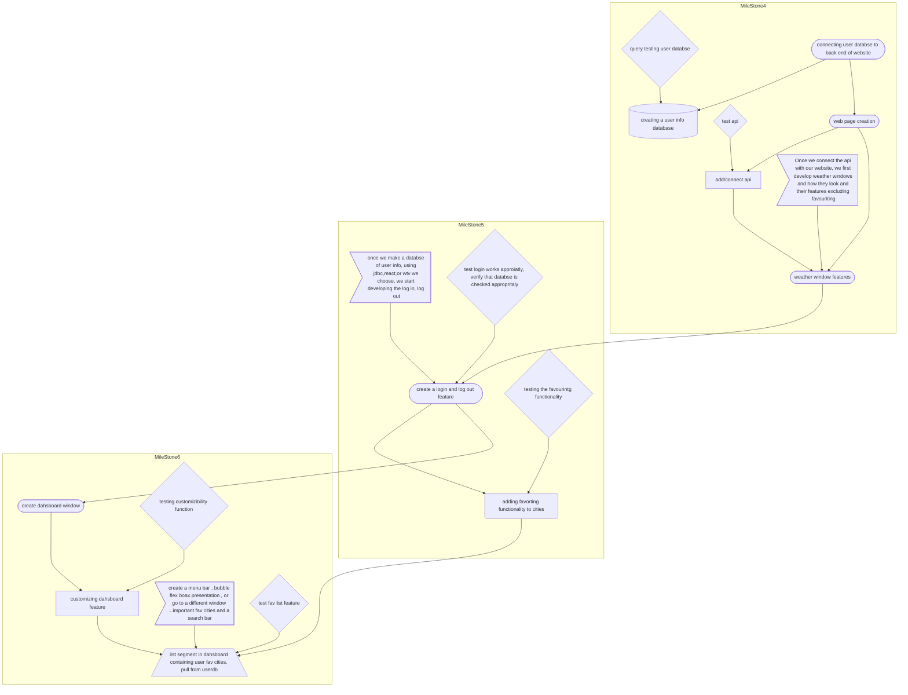

```mermaid
flowchart TD
  
web(["`web page creation`"]) 
api["`add/connect api`"] 
apitest{"`test api`"} 

webfeatures(["`weather window features`"]) 
wfeaturedesc>"`Once we connect the api with our website, we first develop weather windows and how they look and their features excluding favouriting`"] 

userdb[("`creating a user info database`")] 
userdbtest{"`query testing user databse`"} 

connectuserdb(["`connecting user databse to back end of website`"]) 
userdbdesc>"`once we make a databse of user info, using jdbc,react,or wtv we choose, we start developing the log in, log out `"] 
login(["`create a login and log out feature`"]) 
logintest{"`test login works approiatly, verify that databse is checked appropritaly `"} 

favfeature("`adding favorting functionality to cities`")
testfav{"`testing the favourintg functionality`"} 

dasboardwindow(["`create dahsboard window`"]) 
dashboardcust["`customizing dahsboard feature`"] 
testdashboard{"`testing customizibility function`"} 

subgraph MileStone4
web -->api
apitest -->api

web-->webfeatures
api-->webfeatures

wfeaturedesc -->webfeatures

userdbtest-->userdb
connectuserdb-->userdb
connectuserdb-->web
end

subgraph MileStone5

userdbdesc-->login
webfeatures-->login
logintest-->login

login-->favfeature
testfav-->favfeature
end

subgraph MileStone6
login-->dasboardwindow
dasboardwindow-->dashboardcust
testdashboard-->dashboardcust


favlist[/"`list segment in dahsboard containing user fav cities, pull from userdb`"\]
favlistdesc>"`create a menu bar , bubble flex boax presentation , or go to a different window ...important fav cities and a search bar`"] 
favlisttest{"`test fav list feature`"}

favfeature-->favlist
dashboardcust-->favlist

favlistdesc-->favlist
favlisttest-->favlist
end

```