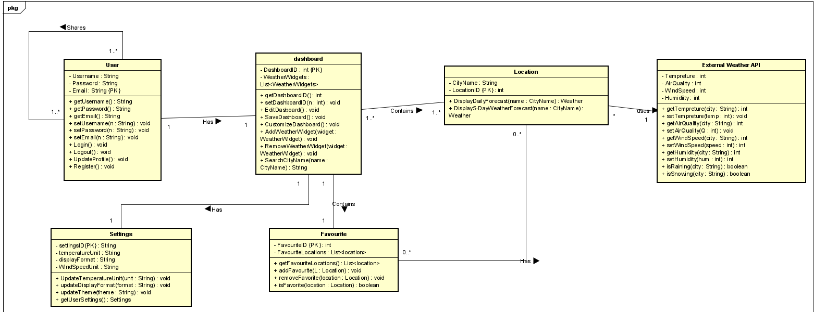
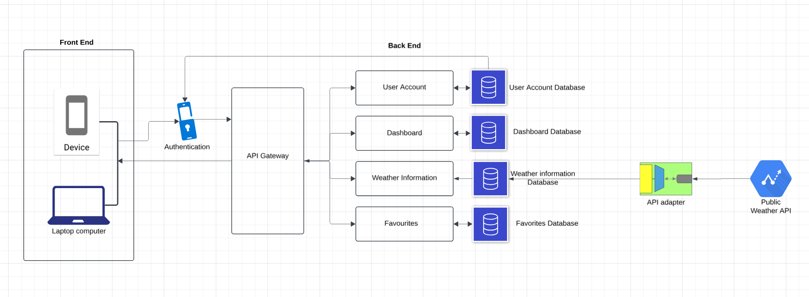

# Project Description: Web-based Weather Application
## The document below outlines the goals and features to be implemented. This document also includes assumptions, constraints and requirements associated with the project.  

### Jimi Ademola, Aliasgar Sakarwala, Mandira Samarasekara, Ali Afoud

The goal of the site in simple terms is to provide an application which can display and share weather based on a user-inputted location. 
The application has a user database and users have login credentials. 
The user will be able to view their dashboard and change the way their info is displayed within the application.

### Goals
- Provide up-to-date real time weather updates.
- Ensure security for customer information including location data, password and email information.
- Allow users to customize the applicatino to their preferences. Include display changes, application units and other accessability features.

### User Details

**Login Details:**
- The user will be prompted with a login screen upon opening the application.
- If the user, does not already have an account they will have the option to create one.
- They will be prompted to input information such as email, name and password.
- Other information such as phone number will be optional.
- If the given account details are invalid for creation such as email, display an error message.
- If the given information for login is incorrect, display an error message to the user.
  

### Display

**Features:**
- If user is not logged in all features pertaining to sharing or customization will not be accessible.
- The user will be greeted with a dashboard upon login, the dashboard will be set to favourite location if one is set in user's account. 
- The dashboard will display the current weather in said location. If no favourite location is entered, the user can input a city throughout the world. 
- The dashboard will then display that city's current forecast and conditions. An option will be visible (a star) which adds the location to a list of user favourited cities.
- The user has the option to expand the 5-day forecast to see more information for each day and their conditions
- The user will be able to change the current info displayed to the screen
- The dashboard can be edited to display information in various orders or remove some other forecasts 
- The user can switch from dashboard display to a list of saved, favourited locations
- In the favourites tab, the list can be managed allowing the user to delete and add any locations to the list.
- Display provides warning for severe weather such as thunderstorm and high heat
- Display shows sunset/sunrise times
- A user will be able to add friends, they can be found using usernames
- Users can share their dashboard with their friends
- Users can update their profile (includes profile picture, username, email and password)
  
**Contraints:**
- Stable network is required for real-time data updates.
- The application should work smoothly across various devices and browsers
- Their may be limits on the data provided by the third-party APIs

**Requirements:**
- The front-end will be developed using React.js, HTML and CSS.
- The back end will use Java to handle accounts.
- The database will be relational and SQL based to store user preferences and location history.
- Users should be able to set their preferred setting. Includes changing units between Metric and Imperial.
- The system should be easily accesabile with a clear and simple layout.
- Page load time under 2 seconds

**Security Implemntations:**
- Rate limiiting to prevent abuse of APIs
- Implement secure password requirements and standards

# High-Level Summary

- The weather app will be a user-focused, **customizable platform** that offers **real-time weather data and a 5-day forecast** for any city worldwide. The application will enable users to **search for the weather of different cities by name**, allowing them to view each city’s current weather conditions and monitor upcoming weather patterns.
- Through an *in-app dashboard*, users will be able to **view their current geolocation weather and temperature** and access a personalized list of favorite cities. Users can **add cities to their favorites** by searching for them in the general search bar or through a custom "add city to favorites" button.
- Users will be able to **customize and select various display formats** such as *background color and theme, text fonts and size, style of displayed icons, moving information boxes, and potentially icon animation*, for the dashboard and city weather display page. With such customizability, users can share their creative dashboards with others by sharing their account (***up for debate on how to share accounts; options include searching by username or submitting customizability settings so others can replicate the dashboard -> (This will further be explored as the project development continues)***).
- The application integrates key software design patterns, such as Adapter, Singleton, and Facade, ensuring a smooth and adaptable interface with a public weather API, while Continuous Integration (CI) and automated testing promote reliability and performance.

# Requirements

### User Requirements

- **Account Management:** Users can create, delete, and edit account information.
- **Dashboard Customization:** Users can edit and customize their dashboards through display and theme changes, units and icon selections, receiving notifications, type of weather display, and more.
- **City Search and Selection:** Users can search for cities worldwide, check their weather info, and select them as favorites to add to a list. The favorite city list will also include a search bar for easier navigation.
- **Dashboard Sharing:** Users can share their dashboards with others.

### Functional Requirements

- **User Authentication:** The system must provide account management functionalities, including login, registration, and secure authentication through encryption of sensitive information during logins, account creation, and deletion.
- **Weather Data Retrieval:** The system must retrieve weather data from an external API and handle conditions such as location not found or data retrieval issues. Using the Adapter Pattern, the system will interact with the weather API, allowing future flexibility in switching providers.
- **Functioning Search Feature:** The system will have two well-functioning search bars to help users find desired cities. One main general search bar, easily accessible from the dashboard to browse and discover new cities, and a specialized search bar within the favorites list segment for easy searching of cities already added to the user's favorites list.
- **Weather Forecast:** Each city page will provide the current hour's temperature and weather, a 24-hour forecast in 1-hour intervals, and an average weather and temperature forecast for the following 5 days and  details of wind speed, UV index, visibility, and humidity for the current day. The dashboard and search views will show a short box with the current weather and temperature.
- **Identifying Users, Cities, and Dashboards:** Every user will have a unique username and incremental user ID. Each city will be identifiable by its name and unique ID, and each dashboard will be associated with its user, identifiable by display settings and the user's ID.

### Non-Functional Requirements

- **Performance:** Weather data retrieval will complete in under 2 seconds, with efficient data parsing and caching. The system architecture will support concurrency to handle multiple data requests without degradation.
- **Scalability:** API request handling must adapt to peak times without exceeding rate limits or affecting performance.
- **Usability and Accessibility:** The UI must be intuitive, with clear navigation, readable fonts, and accessible icons for weather conditions. Accessibility standards, such as WCAG, will be followed, including keyboard navigation, screen reader compatibility, and contrast settings.
- **Reliability:** The system must be consistently available, with fallbacks in case of weather API downtime. Error handling will provide feedback such as “Location not found” or “Weather data temporarily unavailable.”
- **Security and Data Privacy:** Sensitive data will be encrypted in transit and at rest, with secure password handling and token-based user authentication. Compliance with data privacy standards will ensure responsible management of user data.
- **Device Compatibility:** The application must be responsive and compatible with major browsers, enabling a seamless user experience.

### Design Patterns

- **Singleton Design:** The system will implement the Singleton Pattern to ensure a single instance of the API client handles all API requests efficiently. This design maintains centralized control over the API client, providing consistent behavior, resource efficiency, and enhanced security by managing authentication and configuration centrally.
- **Facade Pattern for Interface:** Using the Facade Pattern, the system will create a user-friendly weather application that offers various functionalities and information from complex subsystems. This approach creates a more intuitive and easily maintainable system.
- **Adapter Pattern:** With the Adapter Pattern, the weather app can integrate multiple APIs seamlessly by converting unique API data into a standardized format for ease of use and maintainability. This allows for an easy switch between APIs in case of issues or changes to the codebase in future updates.
- **CI/CD and Automated Testing:** The system will have automated tests covering core functionalities and use CI to streamline the deployment process.

### Use Case Diagram

.png "fig-1: simple Use Case UML")

  

### Class diagram

  

### Architecture diagram

  

# RECALL THE PROJECT ASSIGNEMENT:

# The Project

The project provides you an opportunity to build upon the foundational knowledge acquired in this course. It is designed to help you develop an advanced understanding of software engineering principles, tools, and techniques using structured requirements gathering and analysis, software development process, design patterns, software architecture, and software testing.  You will also need to consider your development methodology (don’t use waterfall), software metrics, and software quality assurance.

As a team, you will select a project, develop a set of requirements, conduct a formal analysis of the project, develop an architecture, and then using TDD and an Agile workflow, iterate and develop your projects.  During your project, you MUST consider design patterns and anti-patterns, TDD, dockerization, and CI/CD.  The goal is not necessarily to build a complex system, but to practice and become comfortable with the techniques, be able to analyze and decompose a problem, and incrementally develop and deploy a solution using a branching workflow.  The systems needs to be properly planned, analyzed, modelled and implement.   

Internally, within your team, you are free to manage efforts and tasks with the understanding that everyone is expected to contribute equally in some fashion.  During the project, you will have the chance to confidentially conduct peer reviews using the credit-earned model (see document on Canvas regarding this) at a number of key points.   Your individual project grade will be impacted using the results of the peer evaluation.   The key point is that if you don’t contribute to the project, your mark will reflect this.  This will be discussed in class.

**You must have:**

* Unit tests and integration tests to ensure code quality and functionality
* A CI to automatically test
* Set of user requirements, identified user groups, and developed use-cases
* Identified what design patterns you are using and describe why
* Dockerized deployment
* Continual and ongoing work using TDD 
* A team between 3-5 people (no more, no less) - target for 4

**Stretch goals:**

* CD pipeline to deploy changes to the codebase
  
## Project Goals:

* To deepen the students' understanding of software engineering principles, tools, and techniques.
* To enable students to apply software engineering principles, tools, and techniques to the development of complex software systems.
* To introduce students to agile development methodologies, software metrics, and software quality assurance.
* To foster collaboration and teamwork among students in the development of software systems.

The goal is to be able to build good code quickly (using the proper processes).  Remember: **Perfect is the enemy of good**

Build incrementally with this in mind, making small and incremental improvements.   

## Project Objectives:

By the end of this project, students will be able to:

* Apply the software development process model, to the development of a software system
* Design software systems using appropriate design patterns and principles
* Develop software architectures for complex software systems
* Use software testing techniques to ensure the quality of software systems
* Apply agile development methodologies to the development of software systems
* Apply software metrics to evaluate the quality of software systems
* Develop software quality assurance plans to ensure the quality of software systems
* Apply and develop a CI/CD pipeline for automated testing and deployment
* Utilize dockerization to containerize your application
* Work collaboratively in teams to develop software systems

**Peer Evaluation:** see [Peer Evaluation](https://canvas.ubc.ca/courses/150415/pages/peer-evaluation?wrap=1)

## Evaluation: 

See Canvas for [details](https://canvas.ubc.ca/courses/150415/pages/the-project).

## The Projects (all are web apps):

**Weather Forecast Application:** Build a simple application that displays current weather information and a 5-day forecast for a user-selected location using a public weather API.  Users will need to create an account so they can access and edit  their dashboard as well as being able to share it with other users.  The system must support location search where users can search for weather information by city name as well as display the current weather showing temperature, weather conditions, and an icon representing the weather (with the user being able to select formats/options for how data is displayed).  The system will also show a 5-day forecast which will display basic forecast information for the next five days.  Users will also be able to save favourite locations for quick access on their dashboard as well as being able to save and share with other users.   The platform should incorporate the Adapter Pattern to interface with the external weather API. the Singleton Pattern to  manage a single instance of the API client and the Facade Pattern to simplify the interface for fetching and displaying weather data.   Additionally, the platform should incorporate Continuous Integration (CI) and automated testing.

## Statement on the Use of GitHub Copilot and Generative AI Tools

Students are permitted and encouraged to utilize AI-powered tools such as GitHub Copilot and other generative AI assistants for coding, user interface (UI), and user experience (UX) design aspects of their projects. These tools can serve as valuable resources to enhance productivity, inspire creativity, and assist in overcoming technical challenges.  The focus of the project is to develop and improve skills surrounding the process of developing software BUT the team must observe the process and work in an iterative fashion using TDD.  

Please see further detals on Canvas in for [Guidelines for Responsible Use](https://canvas.ubc.ca/courses/150415/pages/the-project)
