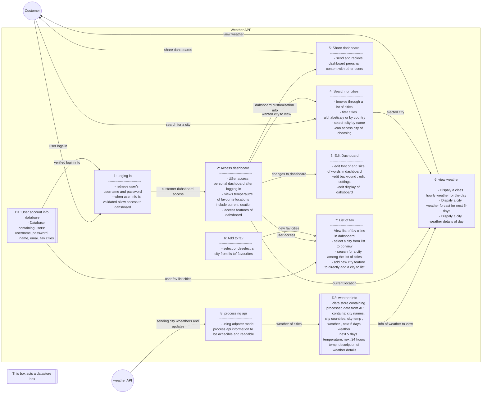

```mermaid

flowchart LR
    

    CT((Customer))
    api((weather API))

   

   
    CT-->|user logs in|lg
    view-->|view weather|CT
    CT-->|search for a city|search

    api -->|sending city wheathers and updates|prapi
    
    share-->|share dahsboards|CT

    

    subgraph front["Weather APP"]

    lg["1: Loging in"
    ----------------------------
         - retrieve user's username and password
         - when user info is validated allow access to dahsboard]

    view["6: view weather"
    ----------------------------
         - Dispaly a cities hourly weather for the day 
         - Dispaly a city weather forcast for next 5-days
         - Dispaly a city weather details of day ]    


    dbinfo[["D1: User account info database"
         - Database containing users: username, password, 
         name, email, fav cities]] 

    
  

    weather[["D2: weather info"
         -data store containing , processed data from API
         contains: city names, city countries, city temp , weather , next 5 days weather 
         next 5 days temperature, next 24 hours temp, description of weather details]]

    
    access["2: Access dashboard "
    ----------------------------
         - USer access personal dashboard after logging in
         - views temperautre of favourite locations include current location
         - access features of dahsboard ] 

    edit["3: Edit Dashboard"
    ----------------------------
         - edit font of and size of words in dashboard
         -edit backround , edit settings
         -edit display of dahsboard] 

    search["4: Search for cities "
    ----------------------------
         - browse through a list of cities 
         - fiter cities alphabeticaly or by country
         - search city by name 
         -can access city of choosing] 

    share["5: Share dashboard "
    ----------------------------
         - send and recieve dashboard perosnal content with other users] 


    fav["6: Add to fav"
    ----------------------------
         - select or deselect a city from lis tof favourites 
         ]
    
    lf["7: List of fav"
    ----------------------------
         - View list of fav cities in dahsboard
         - select a city from list to go view
         - search for a city among the list of cities
         - add new city feature to directly add a city to list ]

     prapi["8: processing api"
    ----------------------------
         - using adpater model process api information to be accecible and readable 
         ]

    
    dbinfo-->|verified login info|lg
    lg-->|customer dahsboard access|access
    access-->|changes to dahsboard|edit
    weather-->|info of weather to view|view
    dbinfo-->|user fav list cities|lf
    access-->|current location|view
    access-->|user access|lf
    fav-->|new fav cities|lf

    access-->|wanted city to view|search
    access-->|dahsboard customization info|share
    search-->|slected city|view
    prapi-->|weather of cities|weather


%% functionality to be added. 
%%Databse for user info can be seperated to more instances for clarity
end


dbox[["This box acts a datastore box"]]

```