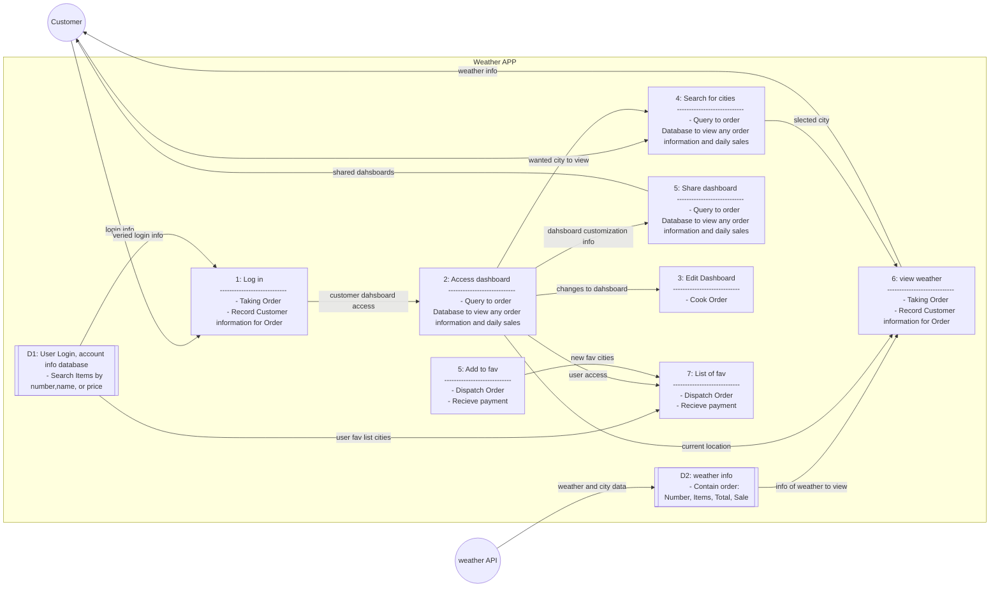

```mermaid

flowchart LR
    

    CT((Customer))
    api((weather API))

   

   
    CT-->|login info|lg
    view-->|weather info|CT
    CT-->search

    api -->|weather and city data|weather
    share-->|shared dahsboards|CT

    

    subgraph front["Weather APP"]

    lg["1: Log in"
    ----------------------------
         - Taking Order
         - Record Customer information for Order]

    view["6: view weather"
    ----------------------------
         - Taking Order
         - Record Customer information for Order]    


    dbinfo[["D1: User Login, account info database"
         - Search Items by number,name, or price]] 

    
  

    weather[["D2: weather info"
         - Contain order: Number, Items, Total, Sale]]

    
    access["2: Access dashboard "
    ----------------------------
         - Query to order Database to view any order information and daily sales] 

    edit["3: Edit Dashboard"
    ----------------------------
         - Cook Order] 

    search["4: Search for cities "
    ----------------------------
         - Query to order Database to view any order information and daily sales] 

    share["5: Share dashboard "
    ----------------------------
         - Query to order Database to view any order information and daily sales] 


    fav["5: Add to fav"
    ----------------------------
         - Dispatch Order
         - Recieve payment]
    
    lf["7: List of fav"
    ----------------------------
         - Dispatch Order
         - Recieve payment]

    
    dbinfo-->|veried login info|lg
    lg-->|customer dahsboard access|access
    access-->|changes to dahsboard|edit
    weather-->|info of weather to view|view
    dbinfo-->|user fav list cities|lf
    access-->|current location|view
    access-->|user access|lf
    fav-->|new fav cities|lf

    access-->|wanted city to view|search
    access-->|dahsboard customization info|share
    search-->|slected city|view


%% functionality to be added. 
%%Databse for user info can be seperated to more instances for clarity
end

```